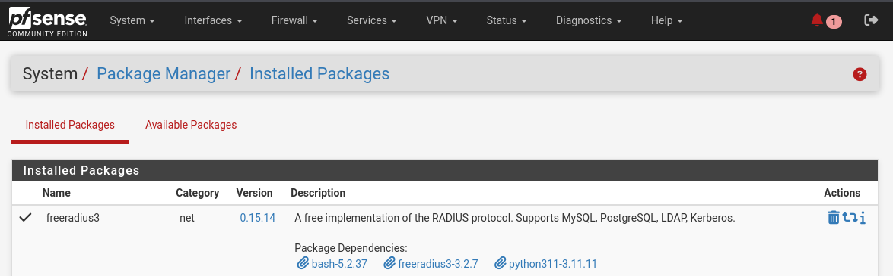
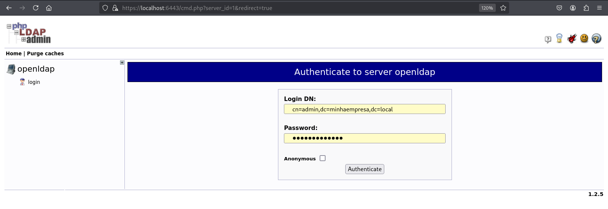
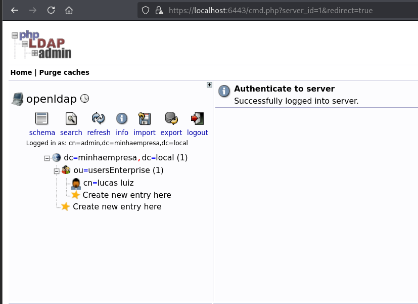
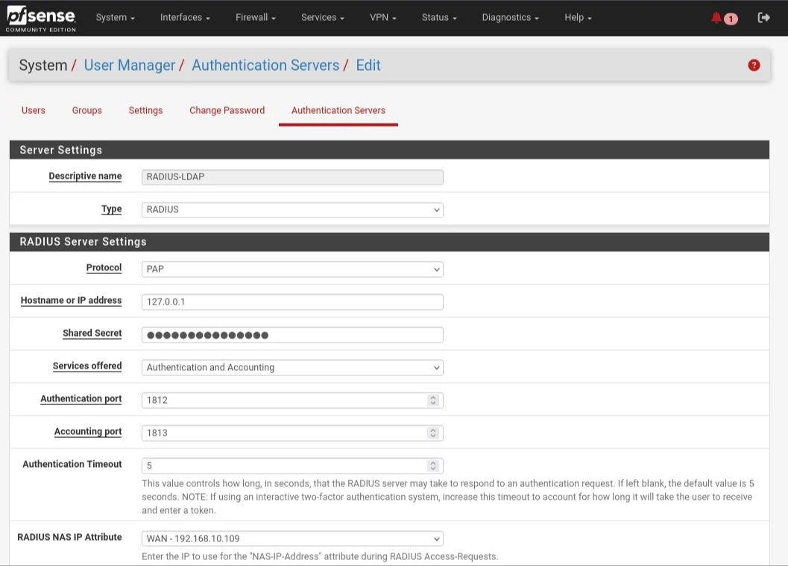
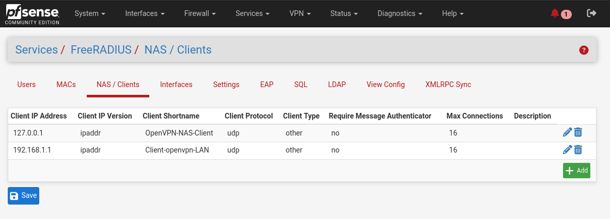
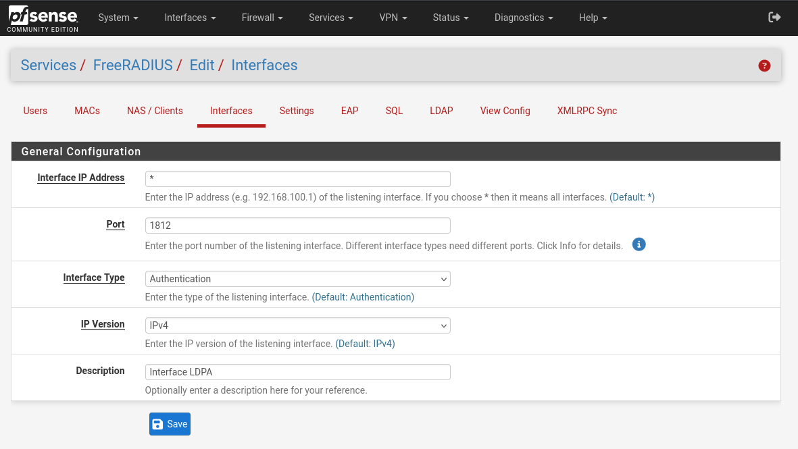

# Integração de autenticação LDPA via RADIUS na VPN OpenVPN.

## ⚙️ Funcionalidade:

Agora, em vez de autenticarmos o usuário por certificados, faremos a autenticação via RADIUS em um servidor LDAP.
Ao executar o arquivo .ovpn, o cliente envia pacotes UDP para o endereço WAN do firewall (192.168.10.109) na porta 1194. Como há regras no firewall permitindo entradas UDP vindas da rede 10.10.10.0/24, o tráfego segue para a etapa de autenticação. Nesse momento, as chaves TLS são trocadas e os certificados (cliente e servidor) são validados.

Em seguida, o OpenVPN solicita as credenciais (usuário e senha cadastrados no LDAP). O cliente as digita e o OpenVPN encaminha um Access-Request no ip 127.0.0.1 (configurado em NAS/Client) ao plugin do FreeRADIUS na porta 1812 (configurada como backend de autenticação no servidor OpenVPN). O FreeRADIUS, por sua vez, realiza uma busca no LDAP em ldap://<IP_do_LDAP>:389 (não em LDAPS/636) de acordo com as definições em Services > FreeRADIUS > LDAP (Base DN, Bind DN, IP/hostname etc.).

Se o LDAP confirmar que o usuário e a senha são válidos, o FreeRADIUS retorna um Access-Accept ao OpenVPN, que finaliza o processo de autenticação (sem encerrar a troca TLS). Ao receber o Access-Accept, o OpenVPN conclui o handshake de dados e estabelece automaticamente o túnel VPN na faixa de IP configurada em VPN > OpenVPN > Servers. A partir daí, o cliente pode trafegar pela rede privada conforme as rotas e políticas definidas.

&nbsp;

## 📍 Etapa 1: Instalando o Plugin FreeRADIUS.

Vá para Package Manager e instale o pacote FreeRADIUS:

> **Observação:** As informações do DN e senha foram [configuradas na parte do Docker.](configuracoes/config-docker.md)

&nbsp;

Visto isso, vamos acessar nosso LDAP por `https://<ip_do_ldap>:6443/` ou `https://localhost:6443/`.

&nbsp;

## Etapa 2: Configurando o LDAP.

- **Funcionalidade:** Esse configuração será o backend de autenticação do nosso servidor OpenVPN.

Nosso LDAP está configurado assim. Vamos segui com as explicações sobre cada parte do nosso diretório.

### Explicação: 

- **DN (Distinguished Name):** É o endereço completo de um entry no diretório, ou seja o DN seria `cn=lucas luiz,ou=usersEnterprise,dc=minhaempresa,dc=local.` Cada parte antes da vírgula é um RDN.
- **RDNs (Relative Distinguished Names):** São as etiquetas que compõem o DN. No nosso caso, seria:
    - **dc=minhaempresa,** **dc=local:** “dc” vem de Domain Component. Define seu domínio LDAP(minhaempresa.local).
    - **ou=usersEnterprise:** “ou” significa Organizational Unit. É como se fosse uma pasta, onde você pode organizar seu LDAP da forma como queira. No nosso caso, é uma pasta onde vamos registrar todos os usuário que vão logar na vpn.
    - **“cn” significa Common Name**. Geralmente é o nome “amigável” ou “comum” do objeto (aqui, o nome do usuário).

&nbsp;

### Visão geral dos tópicos:

| Atributo (RDN) | Significado | Exemplo no seu LDAP |
| --- | --- | --- |
| **dc** | Domain Component (parte do domínio) | `dc=minhaempresa,dc=local` |
| **ou** | Organizational Unit (unidade/pasta) | `ou=usersEnterprise` |
| **cn** | Common Name (nome comum do objeto) | `cn=lucas luiz` |
| **DN completo** | Distinguished Name (endereço completo) | `cn=lucas luiz,ou=usersEnterprise,dc=minhaempresa,dc=local` |

> **Observação:** Caso queira ver a configuração do LDAP (como foi construído essa árvore), [clique aqui:](configuracoes/config-ldpa.md). Por aqui, vamos focar na construção do projeto (integração das ferramentas + explicação teórica).

&nbsp;

Vá em `System > User Manager > Authentication Server` clique em `Add`. 

Preencha os campos com essas informações:

| Tópicos | Valores |
| --- | --- |
| **Descriptive Name** | `Nome do Servidor RADIUS` |
| **Type** | `RADIUS` |
| **Protocolo** | `PAP`|
| **Shared Secret** | `Defina uma senha` |
| **Authentication Port** | `1812 (porta padrão do RADIUS)` |

> **Observação:** Não perca essa senha. Ela serve para autenticação do FreeRADIUS e assinatura dos pacotes RADIUS. Essa senha será usada quando configurarmos o NAS/Client.

&nbsp;

## Etapa 3: Configurando o FreeRADIUS.

Vá em `Services > FreeRADIUS > NAS / Clients` clique em `Add`. 

Preencha os campos com essas informações:

| Tópicos | Valores |
| --- | --- |
| Client IP Adress | `127.0.0.1` |
| Client IP Version | `IPV4` |
| Client Shortname | `Nome para o cliente` |
| Client Shared Secret | `Share Secret criada no passo anterior` |
| Client Protocol | `UDP` |
| Client Type | `other` |

> **Observação:** Porque “127.0.0.1”?
> Como mencionado no [começo do projeto](#️-funcionalidade), boa parte da integração será realizada dentro do próprio firewall. Nesse cenário, por se tratar de tráfego interno, utilizamos o endereço de loopback 127.0.0.1, ajustando apenas a porta de destino, como por exemplo para 1812 (ou seja, 127.0.0.1:1812).

&nbsp;

### O que é um NAS/Client?

É o canal de comunicação entre o OpenVPN e o FreeRADIUS. Como a comunicação ocorre dentro do firewall (OpenVPN → FreeRadius e vice-versa) o ip usado para a transferência de dados é o ip de loopback, alterando apenas a porta de destino.

Portanto, devemos ativar os caminhos de autenticação de loopback (127.0.0.1) e LAN (192.168.1.1).

&nbsp;

### Configurando a Interface do FreeRADIUS.

Nessa mesma janela, `clique em Interfaces.`

Configure assim:

| Tópicos | Valores |
| --- | --- |
| Interface IP Address | `*` |
| Port | `1812` |
| IP Version | `IPV4` |
| Description | `Breve descrição para identificação.` |

Em “Interfaces” seção onde configuramos em que endereço e porta o plugin do FreeRADIUS irá escutar as solicitações. No nosso caso, definimos que as requisições serão atendidas em 127.0.0.1:1812 (porta 1812).

> **Observação:** o símbolo * significa “todas as interfaces”.
> Por isso, usamos * em vez de criar uma regra separada para a interface loopback e outra para a LAN.

&nbsp;

## Etapa 4: Configurando a comunicação com nosso LDAP.

- **Funcionalidade**: Nesta etapa, configuramos a comunicação entre o FreeRADIUS e o nosso servidor LDAP. Os campos `Server Address`, `Identity/Password`, `Base DN` etc. correspondem às credenciais de acesso e ao ponto de partida para navegar na árvore do diretório. Após o FreeRADIUS conectar-se ao LDAP, o plugin executa uma busca (search) na estrutura, usando o filtro definido em `Filter` para localizar o usuário que está sendo autenticado. 
  
<mark>Ainda nessa janela, vá em `LDAP` e clique em `Add`.</mark>

[config-LDAP](images/config-LDAP.png)

Para configurarmos essa comunicação, vamos preencher os seguintes campos:

| Tópicos | Valores | Explicação |
| --- | --- |
| LDAP Authorization Support | `✅` | Habilita o LDAP | 
| LDAP Authentication Support | `✅` | Habilita a autenticação no LDAP |
| Server Address | `192.168.1.100` | Endereço ip onde está o server do LDAP | 
| Server Port | `389` | Porta para comunicação com LDAP (apenas https) |
| Identity | `cn=admin,dc=minhaempresa,dc=local` | O domínio do nosso LDAP |
| Password | `senha para acesso do LDAP` | A senha de acesso do LDAP | 
| Base DN | `[seu DN completo](#visão-geral-dos-tópicos) - ou=usersEnterprise,dc=minhaempresa,dc=local` | O `DN`completo do LDAP |
| Filter | `(&(cn=%{User-Name})(objectClass=inetOrgPerson))` | Filtro onde o freeRADIUS irá pesquisar e autenticar o usuário |

&nbsp;

> **Observação:** Como estamos o modo LDAP (http) e não o LDAPS (https), devemos nos certificar de que as caixinhas de checks "Tls", "StartTLS" e "SSL" estejam desativadas. 

