# Projeto: Criar uma VPN OpenVPN com autenticação via certificados no firewall Pfsense CE 2.7.2.

## Funcionalidade:

O host externo (interface WAN) executará o arquivo .ovpn (configuração da VPN já contendo o cadastro do usuário), o que fará com que pacotes UDP sejam enviados pela porta 1194 (openvpn) ao firewall. Este, por sua vez, permitirá a entrada desses dados via UDP pela WAN, conforme previsto por uma regra de liberação desse protocolo.

Em seguida, será realizada a troca de chaves TLS entre o cliente e o servidor da VPN, estabelecendo uma “pré-conexão” entre as duas partes. Após isso, ocorrerá a validação do certificado do cliente pela autoridade certificadora (CA) e, logo depois, a autenticação das credenciais do usuário (nome de usuário e senha), cadastradas previamente no perfil do cliente no firewall.

Concluídas essas etapas de validação, será estabelecido um túnel VPN seguro e rápido (com criptografia e usando UDP) entre as duas pontas, sendo atribuído ao cliente o IP 10.10.10.X/24.

Com esse IP, e de acordo com as regras configuradas na interface do Firewall e do OpenVPN, o tráfego do cliente terá como destino as sub-redes (hosts) da interface LAN. Assim, o cliente poderá se conectar diretamente e realizar uma varredura (via Nmap) das portas abertas no Metasploitable 2, que está localizado atrás do firewall, no IP 192.168.1.101.

&nbsp;

## ✅ Competências Adquiridas com o projeto:

Esse projeto reuniu conceitos importantes de:

- Criptografia simétrica e assimétrica
- Infraestrutura de chave pública (PKI)
- Configuração segura de VPN com OpenVPN
- Controle de acesso via certificados
- Autenticação de Certificados.
- Regras de firewall para proteção da rede

&nbsp;
  
## 📍 Etapa 1: Criando a Autoridade Certificadora (CA) e Certificados Digitais

### 1.1 Entendendo o papel da CA:

A **Autoridade Certificadora (CA)** é o órgão central que emite certificados digitais para autenticar identidades na rede. Ela atua como uma "terceira parte confiável", validando que os certificados entregues são legítimos.

Em uma infraestrutura de VPN, a CA cria e assina:

- O certificado do **servidor VPN** (que confirma a identidade do servidor)
- O certificado de cada **cliente VPN** (que autentica cada usuário/host)

Esta assinatura garante que só certificados emitidos pela CA são aceitos, prevenindo conexões não autorizadas.

### 1.2 Criando a CA no pfSense:

No pfSense, acesse:

`VPN > OpenVPN > Wizards`

O assistente vai guiar a criação da CA. É fundamental preencher corretamente os dados da CA, como nome, validade, etc. A CA será usada para emitir os certificados seguintes.
 

### 1.3 Criando o certificado do servidor:

No mesmo assistente, você deve criar o certificado do servidor VPN:

- **Server Certificate:** selecione a CA criada para garantir que o certificado seja assinado e validado.
    

- **Criptografia:** configuramos o servidor para usar AES-256 com SHA-256.

    > Observação: Por que AES-256 e SHA-256?

    - **AES (Advanced Encryption Standard) 256 bits**: padrão de criptografia simétrica altamente seguro usado mundialmente, que cifra os dados para manter confidencialidade.
    - **SHA-256 (Secure Hash Algorithm 256 bits):** algoritmo de hash que garante a integridade dos dados, detectando qualquer alteração durante o trânsito.
    
    [Entenda como o algorítimo de criptografia funciona:](/algoritimo-aes256-sha256.md)

- **IPv4 Tunnel Network:** é a faixa de IP que será atribuída aos clientes VPN ao se conectarem. Escolhi 10.10.10.0/24, uma rede privada dedicada para o túnel VPN, garantindo que não haja conflito com redes existentes.
- **Redirect Gateway:** ao habilitar essa opção, todo o tráfego do cliente é roteado pela VPN. Isso significa que, além do acesso à rede interna, o cliente passa a ter todo seu tráfego de internet encapsulado na VPN, aumentando a privacidade.

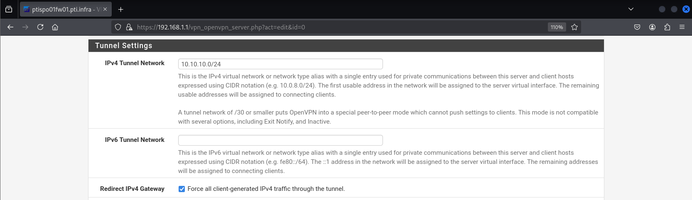

- **Use TLS Key:** TLS (Transport Layer Security) é o protocolo responsável por criar um canal seguro antes mesmo da autenticação. O uso de uma chave TLS estática evita ataques como DoS e replay.
    - Obs.: Vale ressaltar que a Autoridade Certificadora que você criou deve validar o certificado que você está criando, como é mostrado nos últimos campos da imagem.
  
&nbsp;

## 👤 Etapa 2: Criando perfis de usuários com certificados individuais.

Para garantir que apenas usuários autorizados acessem a VPN, cada usuário deve possuir seu próprio certificado digital.

1. Vá para:
    1. `System > User Manager > Add`
2. Crie um usuário com nome e senha.
3. Clique em Add Certificate e vincule o certificado gerado à CA criada anteriormente.

    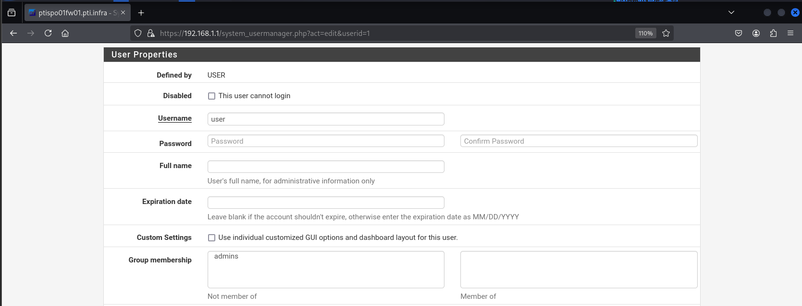

    > Importância dos certificados individuais:
    Cada certificado serve como uma identidade digital única. Isso possibilita revogar acessos específicos, controlar permissões e rastrear usuários na rede.

    Ainda nisso, caso seja necessário revogar o certificado do usuário, vá em 
    `System > Certificates > Certificates > Certificate Revocation`

**Sendo assim, teremos dois certificados assinados pela CA: o certificado do server e o certificado do usuário:**

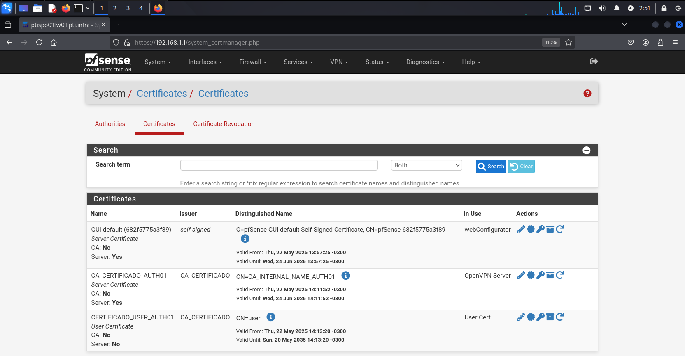

&nbsp;

## 📦 Etapa 3: Exportando o perfil de conexão do cliente.
O arquivo `.ovpn` é o perfil que contém:

- Configurações de conexão
- Certificados (CA, usuário e chave privada)
- Parâmetros de criptografia e autenticação.

No pfSense:

`VPN > OpenVPN > Client Export`

- Confirme que o perfil exportado aponta para o servidor correto e escolha o modo “most clients”.

.png)
.png)

> Exporte esse arquivo para o host externo que está na rede WAN.

&nbsp;

## 🔥 Etapa 4: Configurando as regras de firewall.

### 4.1 Na interface WAN:

Para permitir a entrada de conexões VPN, crie uma regra:

- **Source:** qualquer (`any`) — porque clientes externos podem ter IPs variados
- **Destination:** endereço WAN do firewall
- **Protocolo:** UDP na porta 1194 (padrão OpenVPN)

Isso autoriza os clientes a se conectarem ao servidor.

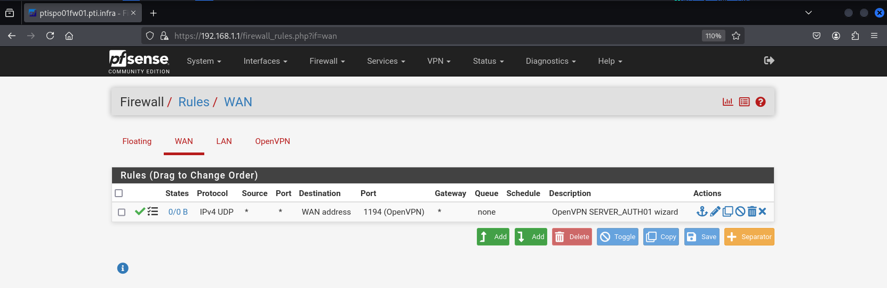
 

### 4.2 Na interface OpenVPN:

Essa regra controla o que clientes VPN podem acessar na rede interna:

- **Source:** rede do túnel VPN (`10.10.10.0/24`)
- **Destination:** sub-rede LAN

Permite o acesso dos clientes aos dispositivos internos.

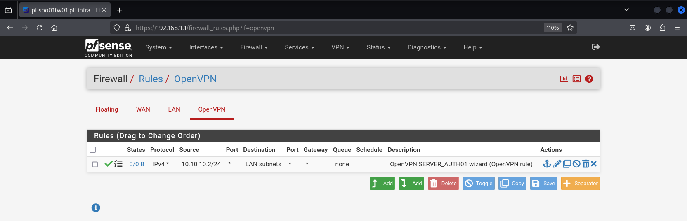

&nbsp;

## 🧪 Etapa 5: Conectando via cliente OpenVPN

No host externo (no mesmo diretório onde está o arquivo .ovpn), execute:
`sudo openvpn --config <nome do arquivo.ovpn>`

- Informe usuário e senha.
- Se aparecer “Initialization Sequence Completed”, a conexão está estabelecida

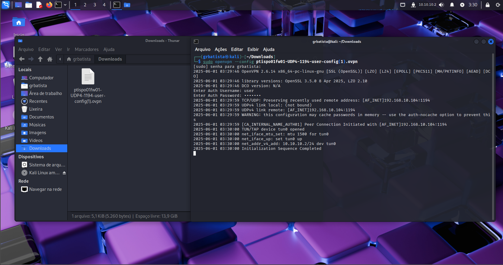

Essa mensagem indica que:

- O túnel TLS foi configurado
- Os certificados foram validados
- O túnel VPN (via CDHE) está ativo
- As regras de firewall permitem o tráfego.

&nbsp;

### 🧭 Etapa 6: Verificação da conectividade

Após conectar:

- O cliente recebe um IP na faixa do túnel (no caso: `10.10.10.2`).
- Use `ip a` para verificar interfaces de rede.

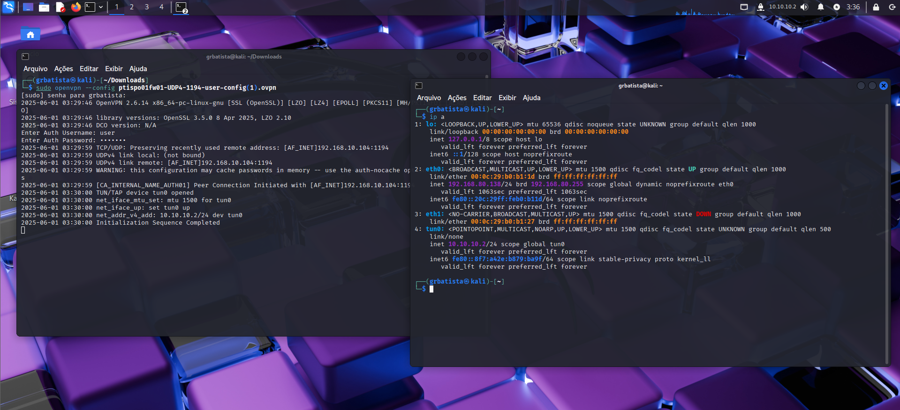

- Teste a conectividade com a interface LAN (192.168.1.1) e o metasploitable no ip 192.168.1.101:

`ping 192.168.1.1` #gateway LAN
`ping 192.168.1.101` #metasploitable interno

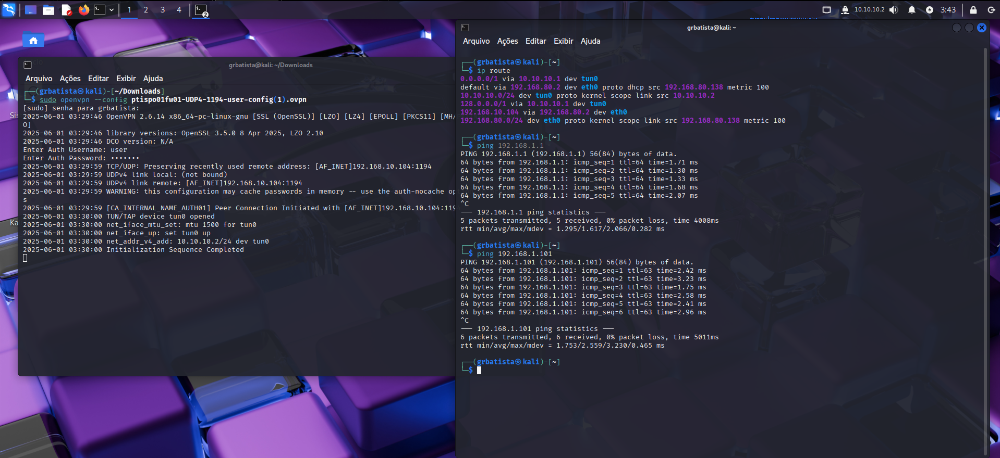
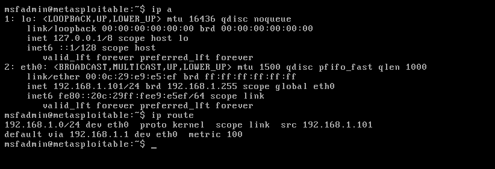

Como podemos ver, o ping ocorreu corretamente, sem nenhuma perda de pacotes. 🙂

Além disso, se executarmos o comando `ip route` veremos que um dos gateways do nosso host WAN é o ip 192.168.10.104, que é justamente o ip da interface WAN do firewall.

Por fim, vamos fazer uma varredura nas portas que estão abertas no metasploitable 2:

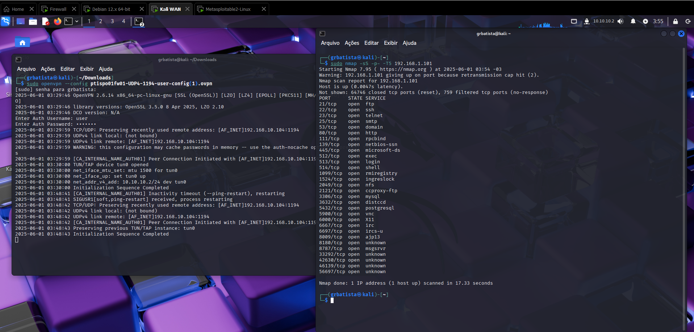

&nbsp;

# 🔎 Curiosidade: O que é e como funciona um certificado?

Certificados são documentos assinados por uma Autoridade Certificadora (CA). Ou seja, a CA gera um certificado para o usuário e o assina com sua chave privada (podemos ver isso no bloco <ca> dentro do arquivo .ovpn); em seguida, ela gera outro certificado para o servidor, seguindo os mesmos procedimentos.

Quando o processo de autenticação se inicia, primeiro o usuário valida o servidor verificando se o certificado deste foi assinado pela CA. Se essa validação for bem-sucedida, o fluxo se inverte: o servidor agora valida o certificado do usuário, conferindo a assinatura da mesma CA. Se ambos os processos forem aprovados, a autenticação se conclui e o usuário pode prosseguir com seu objetivo.

Os certificados digitais contêm:

- **Chave pública:** usada para criptografia e verificação
- **Chave privada:** sigilosa, usada para descriptografar dados
- **Assinatura da CA:** garante autenticidade
- **Dados do emissor (Issuer) e do titular (Subject)**
- **Validade**

Extraia os blocos `<ca>`, `<cert>`, `<key>` do `.ovpn` para um arquivo `.pem`, e execute:

`openssl x509 -in arquivo.pem -text -noout`

Isso mostra:

- Versão do certificado
- Número serial (único)
- Algoritmo de assinatura (SHA256 + AES256)
- Emissor (CA)
- Validade (ex.: 10 anos)
- Titular (nome do usuário).

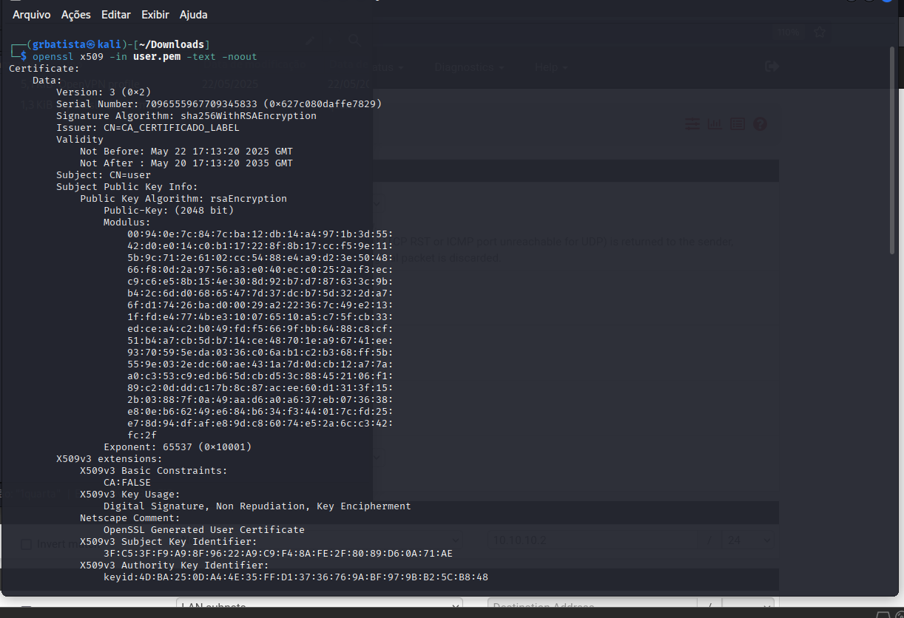

&nbsp;