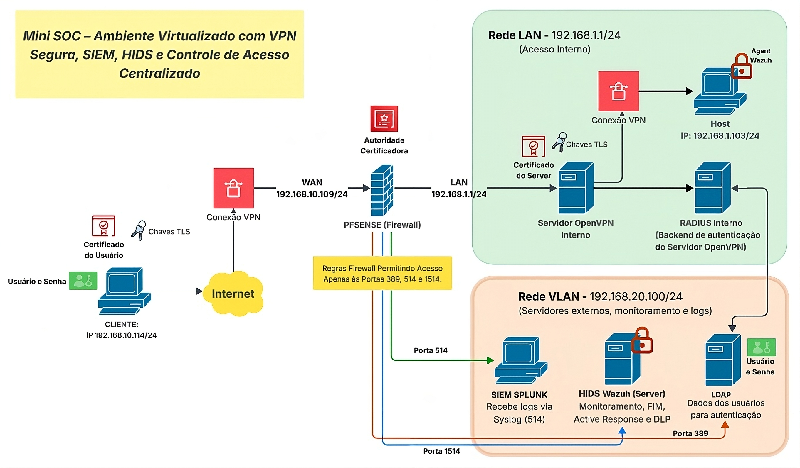
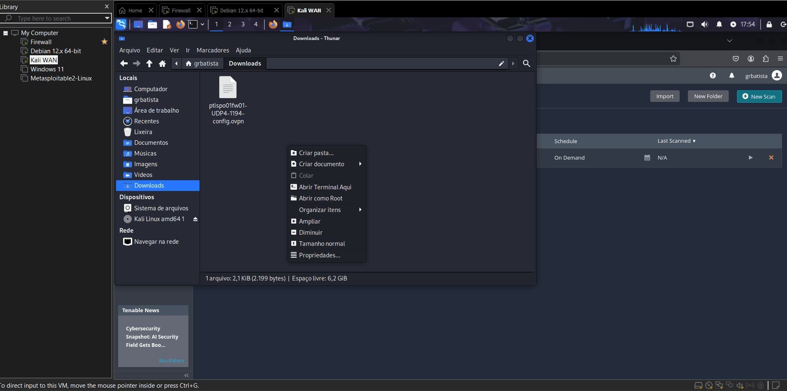
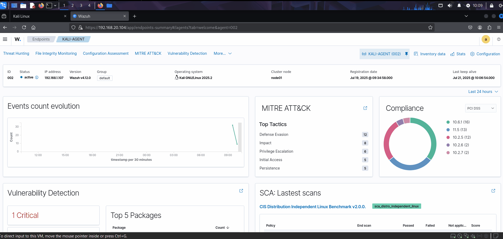

# 🛡️ Projeto OpenVPN com Autenticação Centralizada e Monitoramento

## 📌 Objetivo
Simular um ambiente corporativo seguro com foco em autenticação centralizada, segmentação de rede e monitoramento contínuo. O projeto utiliza OpenVPN integrado ao FreeRADIUS e OpenLDAP para controle de acesso via VPN, garantindo autenticação de usuários com base em diretórios corporativos. A solução também incorpora:

- **Splunk**, para coleta e análise de logs de autenticação, conexão e eventos de rede;

- **Wazuh**, para monitoramento de endpoints com verificação de integridade de arquivos (FIM), resposta automatizada a incidentes (Active Response) e simulação de políticas de DLP;

- **Nessus**, como ferramenta de varredura de vulnerabilidades na rede interna, identificando possíveis pontos de risco expostos após a conexão do cliente VPN.

Todo o ambiente é **segmentado em VLANs** (dados críticos como servers e logs), com regras de firewall específicas para restringir a comunicação entre os serviços, simulando uma infraestrutura corporativa segura.

## 🧩 Arquitetura

&nbsp;

## 📁 Estrutura do Projeto
| Pasta	| Descrição | 
| --- | --- |
| `1-Autenticacao-certificados` | Configuração inicial do OpenVPN com autenticação via certificados TLS. |
| `2-Autenticacao-LDPA-RADIUS` | Integração do OpenVPN com FreeRADIUS + OpenLDAP. |
| `3-Integracao-com-Splunk` | Configuração do Splunk para coleta e visualização dos logs de autenticação. |
| `4-Integracao-com-Nessus` | Integração com Nessus para análise de vulnerabilidades. |
| `5-Integracao-com-Wazuh` | Integração com Wazuh para monitoramento dos hosts.  |

&nbsp;

## 🚧 Status do Projeto
✅ Funcional nas VMs locais  
❌ Ainda não dockerizado (documentado para execução manual)

&nbsp;

## 📷 Prints da Funcionalidade:

### Conexão com a VPN e atribuição do IP.

### Logs OpenVPN e Radiusd no Splunk

### Analise de Vulnerabilidade com Nessus.

### Monitoramento dos host Wazuh Agent.

&nbsp;

## 📜 Como rodar (manual)
- Escolha um software de virtualização que você preferir.
- Instale a imgem do PfSense CE - [link](https://www.pfsense.org/download/)
- Instale o OpenVPN (Windows) - [link](https://openvpn.net/client/)
- Instale o Nessus - [link](https://www.tenable.com/downloads/nessus?loginAttempted=true)

&nbsp;

## 📚 O que aprendi
Este projeto me proporcionou uma experiência prática com os principais componentes de um mini-SOC (Security Operations Center), permitindo a integração de soluções reais em um ambiente de laboratório simulado. Os principais aprendizados incluem:

- Criação de uma estrutura de autenticação corporativa, utilizando OpenVPN integrada ao FreeRADIUS e a um servidor LDAP para controle centralizado de acesso.
- Configuração do FreeRADIUS para autenticação com base em LDAP, incluindo testes de login, filtros de consulta e afins.
- Encaminhamento e análise de logs no Splunk, com foco em eventos críticos de autenticação, conexão VPN, execução de serviços e segurança de rede.
- Integração e comunicação entre diferentes serviços (OpenVPN, RADIUS, LDAP, Splunk, Nessus, Wazuh) em uma rede segmentada, com VLANs e regras de firewall aplicadas.
- Simulação de um ambiente de segurança defensiva, com:
    -Escaneamento de vulnerabilidades via Nessus
    -Monitoramento de endpoints com Wazuh **(FIM, DLP, Active Response);**
    -Análise e resposta a incidentes de forma automatizada.
- Prática com logs reais, reforçando a habilidade de identificar eventos suspeitos, entender o fluxo de autenticação e realizar análises forenses básicas.
- Criação de regras de rede e segmentação com VLANs, aumentando a segurança e controle do tráfego entre serviços sensíveis.

&nbsp;

## 💪🏻 Desafios enfrentados:
- Comunicação entre RADIUS e LDAP com `radtest`
- Comunicação entre OpenVPN e o plugin FreeRadius
- Configuração e funcionamento correto da Vlan
- Funcionamento do Splunk em uma Vlan
- Regras OpenVPN para acesso do cliente aos hosts da LAN
- Estruração do LDAP